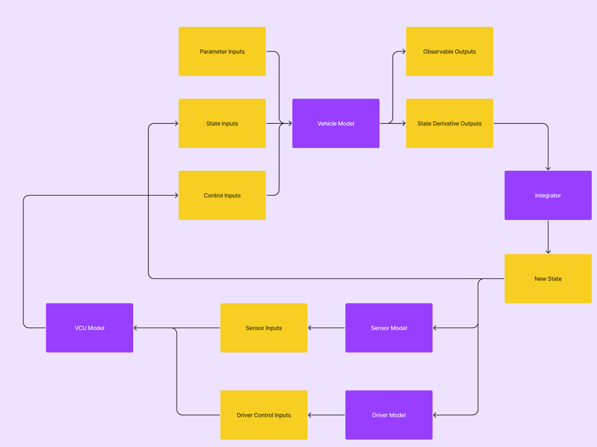
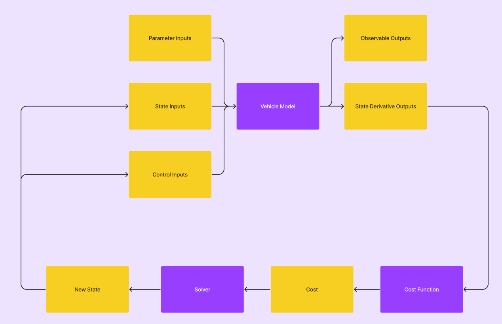

# Contributing

## Setup

1. Install [PyCharm Community Edition](https://www.jetbrains.com/pycharm/download/). Scroll down for the free version!
2. (dependencies and other stuff will go here)

## Steps

1. Communicate in the #simulation channel on Slack!
2. Check the issues page and pick a feature/bug you want to work on, or write a new issue.
3. Create a new branch to implement your feature.
4. Make a pull request once it's ready.

## Structure

[This diagram](https://www.figma.com/file/z98vFbTBytWElKBb5sTkwk/Lapsim-v2024-Architecture?type=whiteboard&node-id=0%3A1&t=9tSSjFzoum59gmc6-1)
can help you get a starting point to understanding the project.

Within the **sim/** package, there are three main packages.
The **sim/model_parameters/** package has classes that just serve to store parameters.
These are mostly numerical vehicle parameters like Car's `mass` but there
are also some other ones like Telemetry's `accelerometer_rate`.
Note that some parameters can even be functions using the CurveParameter class,
like a battery's voltage as a function of charge.

The **sim/simulations/** package contains a few different kinds of simulations
that interact with the vehicle model in different ways. The TransientSimulation
is a discrete-time simulation that involves a driver, telemetry, and a
vehicle control unit in addition to the vehicle model, as seen below.

### Transient Simulation (Integrator)

There's also a SteadyStateSimulation that iteratively guesses states where the
vehicle is stable, and uses them to construct a performance envelope and other
metrics.

### Steady-State Simulation (Solver)

The performance envelope can then be used in the competition simulation
to predict lap times and dynamic event scores. It can also be used as a guide
for the driver model in the transient simulation.

Finally, the **sim/system_models/** package is where the actual model components
that update state are stored. These are the models that are used by the simulation
classes, and they are given their respective parameters (from **workspace.py**
for example) on initialization. The systems also have an **eval()** method, which
usually accepts an input vector and returns an output vector.

## Style

For formatting, just use Ctrl+Alt+L to reformat in PyCharm.
