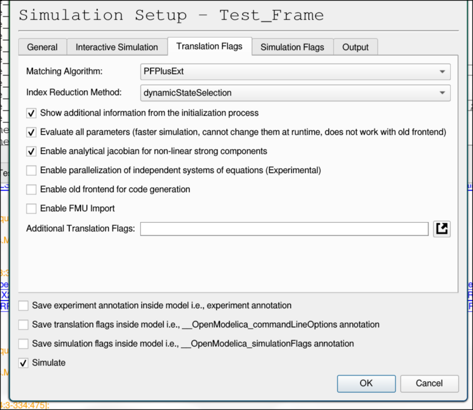

___
# Simulation Toolkit

### Dependencies (terminal):

You'll need a unix terminal to execute the necessary commands. MacOS and Linux have this by default, typically called "terminal". If you're using Windows, install [git bash](https://git-scm.com/downloads/win).

___

### Dependencies (make):

This project utilizes [make](https://www.gnu.org/software/make/) to simplify the setup and execution of our project. MacOS and Linux distros typically come with this preinstalled, but Windows does not. The following section details how to install make on each OS, in the event that it isn't installed.

To check whether you already have make installed, run the following command in a terminal:

```shell
make --version
```

If this runs without error, skip past this section. If you receive an error, install make using the steps below:

##### Windows
1. Click the following link, which downloads make from GnuWin32

    [make download](https://sourceforge.net/projects/gnuwin32/files/make/3.81/make-3.81.exe/download?use_mirror=psychz&download=)

2. Run the downloaded .exe, following the installation prompts. Make sure to leave the default install paths.

3. Go to Windows search and access "Edit the system environment variables".

    <center>
        
    </center>

4. Select "Environment Variables"

    <center>
        
    </center>

5. Edit Path

    <center>
        
    </center>

6. Add the following path

    <center>
        
    </center>

##### MacOS
1. Install homebrew by running the following command in terminal:
    
    ```shell
    /bin/bash -c "$(curl -fsSL https://raw.githubusercontent.com/Homebrew/install/HEAD/install.sh)"
    ```

2. Install make by running the following command in terminal:

    ```shell
    brew install make
    ```

##### Linux (Debian-based distros)
1. Run the following command in terminal

    ```shell
    sudo apt update && sudo apt install -y make
    ```

##### Linux (Arch)
1. Run the following command in terminal

    ```shell
    sudo pacman -Su make
    ```

### Dependencies (git):

Git is required to clone repositories from Github. It's also required for code development and version control.

##### Windows
1. If you already installed Git Bash, this is covered

##### MacOS
1. Make sure you've installed Homebrew from the previous step (make)

2. Install Git from the command line using:
    ```shell
    brew install git
    ```

##### Linux (Debian-based distros)
1. Run the following command in terminal
    ```shell
    sudo apt-get install git
    ```

##### Linux (Arch)
1. Run the following command in terminal
    ```shell
    sudo pacman -Su git
    ```

Once you've installed Git, it still needs to be configured. First, set your name and email (associated with commits). This can be achieved with the following command:

```shell
git config --global user.name "Your Name"
git config --global user.email "you@example.com"
```

### Dependencies (OpenModelica):

Go to the [OpenModelica Website](https://openmodelica.org/). Under "Download", pick your specified operating system. Installation varies across machines, but reach out to code owners if you run into any issues. Note that this process is easiest on Windows and probably most difficult on MacOS (need to install via a Docker container).

##### Arch
1. Run the following commands in terminal
    ```shell
    yay -S openmodelica
    yay -S openmodelica-omlibraries
    ```
Make sure the second checkbox is checked
    <center>
        
    </center>
### Dependencies (docker):

Docker isn't required to run workflows locally, but it is highly recommended. Docker containers give a unified runtime environment, making debugging easier with fewer runtime issues.

##### Windows
1. Click the following link, and select the proper download for your machine

    [docker download](https://www.docker.com/products/docker-desktop/)

2. Run the downloaded .exe, following the installation prompts. Make sure to leave the default install paths.

3. Go to Windows search and open the new Docker Desktop application.
   
4. Check if docker installed successfully by running the following command (in git bash)
  
   ```shell
   docker run hello-world
   ```

##### MacOS
1. Install make by running the following command in terminal:

    ```shell
    brew install --cask docker
    ```
2. Check if docker installed successfully by running the following command
  
   ```shell
   docker run hello-world
   ```

##### Linux (Debian-based distros)
1. Run the following commands in terminal

    ```shell
    sudo apt-get update
    
    sudo apt-get install \
        ca-certificates \
        curl \
        gnupg \
        lsb-release

    sudo mkdir -p /etc/apt/keyrings

    curl -fsSL https://download.docker.com/linux/ubuntu/gpg | \
        sudo gpg --dearmor -o /etc/apt/keyrings/docker.gpg

    echo \
      "deb [arch=$(dpkg --print-architecture) signed-by=/etc/apt/keyrings/docker.gpg] \
      https://download.docker.com/linux/ubuntu \
      $(lsb_release -cs) stable" | \
      sudo tee /etc/apt/sources.list.d/docker.list > /dev/null

    sudo apt-get update
    
    sudo apt-get install docker-ce docker-ce-cli containerd.io

    sudo usermod -aG docker $USER

    newgrp docker
    ```
    
2. Check if docker installed successfully by running the following command
  
   ```shell
   docker run hello-world
   ```

##### Linux (Arch)
1. Run the following commands in terminal

    ```shell
    sudo pacman -Syu docker

    sudo systemctl enable docker.service

    sudo systemctl start docker.service

    sudo usermod -aG docker $USER

    newgrp docker
    ```
2. Check if docker installed successfully by running the following command
  
   ```shell
   docker run hello-world
   ```
    
Assuming you already have [Python](https://www.python.org/downloads/) installed, this covers all requirements for the project.

___


### Running a Workflow

There are two methods for running workflows locally. You can run through docker containers (recommended) OR you can call python directly.

#### Method 1: Running via Docker
1. Open the Docker application

2. Run the following command in terminal

   ```shell
   make test
   ```

   This runs the full testing workflow to ensure docker runs properly

3. Run the desired simulation workflow. Options are shown below:

   ```shell
   make sim SIM=kin MODEL_PATH=Nightwatch.yml

   make sim SIM=kin MODEL_PATH=Nightwatch.yml COMPARISON_PATH=Scratchpad.yml

   make sim SIM=qss MODEL_PATH=Nightwatch.yml
   ```

4. Locate the workflow outputs under ./outputs

#### Method 2: Running via Python Directly
1. Create and activate a virtual environment in "./simulation_toolkit" to contain the necessary Python libraries.
    
    - MacOS or Linux
    ```shell
    python3 -m venv .venv
    source .venv/bin/activate
    ```

    - Windows:
    ```shell
    python -m venv .venv
    source .venv/Scripts/activate
    ```

2. Open a terminal directed at "./simulation_toolkit"

3. Run the following command:

    ```shell
    make init
    ```

    This installs the necessary Python libraries and remote files for project functionality.

4. Run the desired simulation workflow. Options are shown below:

    - MacOS or Linux
    ```shell
    python3 -m kernel kin Nightwatch.yml

    python3 -m kernel kin Nightwatch.yml Scratchpad.yml

    python3 -m kernel qss Nightwatch.yml
    ```

    - Windows:
    ```shell
    python -m kernel kin Nightwatch.yml

    python -m kernel kin Nightwatch.yml Scratchpad.yml

    python -m kernel qss Nightwatch.yml
    ```
    
5. Locate the workflow outputs under ./src/simulations/{your simulation name}/{your simulation name}_outputs
